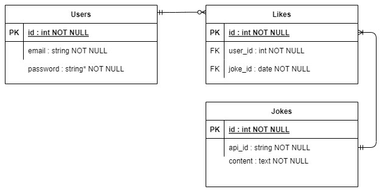

# Norrinspiration

This app allows the user to fetch jokes from from [Chuck Norris API](https://api.chucknorris.io/). The user can add or delete a joke to the list of favorite jokes, every time a joke is liked, it is saved to the local database.

This app uses HotWire to dynamically load the sections and jokes from the API and display them on the screen.

It was developed using TDD, and is fully translatable to spanish (i18n).

- ERD: The ERD diagram that represents the database is the following:

> 

## Built with

- Ruby v3.0.1
- Ruby on Rails v7.0.3

## Live Demo:


The App was deployed on Heroku, but also on AWS Elastic Beanstalk, using AWS ERD service.

[Heroky deployment](https://norrinspiration.herokuapp.com/)

[AWS deployment](http://norrinspiration-env.eba-iasjhydg.us-east-1.elasticbeanstalk.com/)

> user: ```admin@admin.com``` \
> password: 123123123

## Getting Started

To get a local copy up and running follow these simple example steps.

### Prerequisites

- Ruby and Ruby on Rails installed on your computer

- Postgres: >=9.5

- A github account

- A terminal with your github account logged in

### Setup

- Use your github account and your terminal to clone this repository to your computer:

`git clone git@github.com:carlos-osorio-developer/chuck-norrinspiration.git`

- Go to the cloned directory:
`cd chuck-norrinspiration`

- Run `bundler install` to install the Gems for the project

- Run `yarn install` to install the project dependencies

- Run `rails db:create` to create the database

- Run `rails db:migrate` to setup the database

- Run `rspec` to run the tests

### Usage

- Run `rails s` and go to `http://localhost:3000/` in your browser.

## ToDo

  - Add routes to switch between languages.
  - Autodisclose notifications.
  
## Author

👤 **Carlos Osorio**

- GitHub: [@carlos-osorio-developer](https://github.com/carlos-osorio-developer)

- Twitter: [@OsorioDevelops](hhttps://twitter.com/@OsorioDevelops)

- LinkedIn: [Carlos Osorio](https://www.linkedin.com/in/carlos-osorio-developer/)
​
## 🤝 Contributing

Contributions, issues, and feature requests are welcome!

## Show your support


Give a ⭐️ if you like this project!


## Acknowledgments

- [Alternova Inc.](https://www.alternova.co/)

## 📝 License

This project is [MIT](./MIT.md) licensed.
